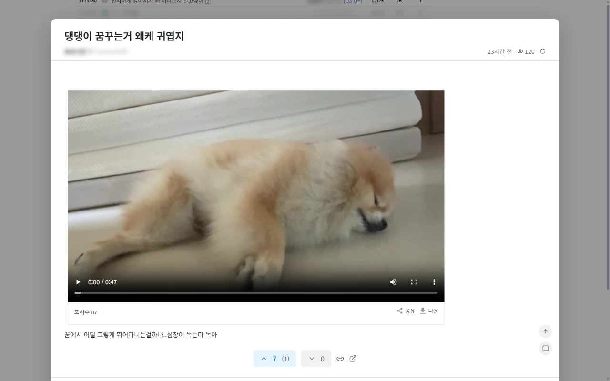
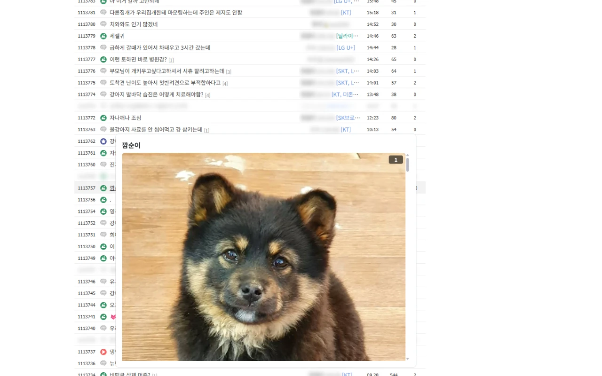

    
    <h1>DCRefresher Reborn</h1>
    
디시인사이드 개선 확장 프로그램

    

        
        
        
    

    

        <a href="https://chromewebstore.google.com/detail/pmfifcbendahnkeojgpfppklgioemgon"><b>Chrome에 설치</b></a>
        ·
        <a href="https://addons.mozilla.org/ko/firefox/addon/dcrefresher-reborn"><b>Firefox에 설치</b></a>
        ·
        <a href="https://github.com/green1052/DCRefresher-Reborn/wiki">위키</a>
        ·
        <a href="https://github.com/green1052/DCRefresher-Reborn/issues">버그 제보</a>
    

    

글을 열지 않고 목록에서 미리 보고 목록을 자동으로 새로고침합니다. 보고 싶지 않은 유저와 글은 가리고 작성자 옆에는 IP 정보(통신사·국가·VPN)와 메모를 보여 줍니다.

    
    

## 설치

| 브라우저 | 설치 |
|---|---|
| Chrome (Edge, Whale 등 크로뮴 계열 포함) | [Chrome 웹 스토어](https://chromewebstore.google.com/detail/pmfifcbendahnkeojgpfppklgioemgon) |
| Firefox | [Firefox Add-ons](https://addons.mozilla.org/ko/firefox/addon/dcrefresher-reborn) |

Chrome 140, Firefox 144 이상에서 동작합니다.

설치한 뒤 툴바의 확장 아이콘을 누르면 팝업이 열립니다. 팝업에서 모듈을 켜고 끄며 톱니바퀴 버튼으로 옵션 페이지(설정·차단·메모·단축키·데이터·정보)를 엽니다.

## 사용법

### 미리보기

- 글 목록에서 제목을 **우클릭**하면 미리보기 창이 열립니다. 좌클릭은 원래대로 글로 이동하는데, 설정의 `미리보기 키 반전`을 켜면 반대가 됩니다.
- 목록의 **댓글 수**를 우클릭하면 댓글만 보기로 열리고 좌클릭은 원래대로 댓글 위치로 이동합니다. 이것도 `미리보기 키 반전`을 켜면 반대가 됩니다.
- 원래 우클릭 메뉴가 필요하면 **Shift+우클릭**을 하거나, Windows에서는 오른쪽 버튼을 길게 눌렀다 뗍니다.
- 창 안에서 **PageUp** / **PageDown**으로 목록의 앞·뒤 글로 넘어갑니다. 창 맨 아래(맨 위)에서 휠을 한 번 더 굴려도 넘어갑니다.
- **Esc**나 창 바깥 클릭으로 닫습니다. `주소창에 게시글 주소 표시`(기본 켜짐)가 켜져 있으면 브라우저 뒤로 가기로도 닫히고, 닫은 미리보기를 앞으로 가기로 다시 열 수 있습니다.
- 제목에 마우스를 올리면 뜨는 **미니 미리보기**는 설정에서 켭니다(기본 꺼짐).
- 본문 **이미지**를 누르면 창 안에서 크게 봅니다. **←** / **→**로 넘기고 Esc로 닫습니다.
- 목록에서 **J** / **K**로 글을 고르고 **Enter**로 미리보기, **O**로 글을 엽니다. **Esc**로 선택을 풉니다.

### 글 목록 새로고침

- 이 탭을 보고 있지 않을 때 들어온 새 글 수를 탭 제목 앞에 `(3)`처럼 붙입니다.
- 기본으로 다른 탭을 보는 동안은 새로고침을 쉽니다. `숨은 탭에서도 새로고침`을 켜면 느린 주기(기본 30초)로 계속 받습니다.

### 단축키

| 기능 | 기본 키 |
|---|---|
| 글 목록 새로고침 | `Alt+R` |
| 자동 새로고침 일시정지 | `Alt+S` |
| 스텔스 모드: 이미지 잠시 보이기 | `Alt+P` |
| 이 페이지에서 가린 내용 보기 | 없음 |

키는 브라우저의 확장 프로그램 단축키 설정에서 바꿉니다. 그 화면은 옵션 페이지 **단축키** 탭의 **단축키 설정** 버튼으로도 열 수 있습니다. 갤러리 관리 권한이 있으면 미리보기 창에서 `D`를 두 번 눌러 글을 삭제하고 `B`를 두 번 눌러 작성자를 차단할 수 있습니다(설정에서 키 변경).

## 주요 기능

기능은 모듈 단위로 나뉘어 있고 따로 켜고 끌 수 있습니다. 모듈마다 자세한 설명은 [위키](https://github.com/green1052/DCRefresher-Reborn/wiki)에 있습니다.

| 모듈 | 하는 일 |
|---|---|
| [미리보기](https://github.com/green1052/DCRefresher-Reborn/wiki/preview) | 목록에서 글과 댓글을 창으로 보고, 댓글 쓰기·추천·앞뒤 글 넘기기를 합니다 |
| [글 목록 새로고침](https://github.com/green1052/DCRefresher-Reborn/wiki/refresh) | 목록을 자동으로 새로고침하고 새 글을 표시합니다 |
| [콘텐츠 차단](https://github.com/green1052/DCRefresher-Reborn/wiki/block) | 닉네임, 아이디, IP, 제목, 내용, 댓글, 디시콘 등으로 글과 댓글을 숨기거나 흐리게 합니다 |
| [유저 정보](https://github.com/green1052/DCRefresher-Reborn/wiki/userinfo) | 작성자 옆에 아이디, IP 정보(통신사·국가·VPN), 메모, 글댓비·깡계·갱차 배지를 표시합니다 |
| [레이아웃 수정](https://github.com/green1052/DCRefresher-Reborn/wiki/layout) | 좁은 화면용 컴팩트 모드와 페이지 요소 숨기기를 제공합니다 |
| [폰트 교체](https://github.com/green1052/DCRefresher-Reborn/wiki/fonts) | 페이지와 미리보기의 폰트와 본문 글자 크기를 바꿉니다 |
| [이미지 검색](https://github.com/green1052/DCRefresher-Reborn/wiki/imagesearch) | 디시 이미지를 우클릭해 검색 엔진(SauceNao, Google Lens 등)에서 찾습니다 |
| [요청 제한](https://github.com/green1052/DCRefresher-Reborn/wiki/requests) | 디시인사이드로 한꺼번에 보내는 요청 수를 제한해 차단을 막습니다 |
| [스텔스 모드](https://github.com/green1052/DCRefresher-Reborn/wiki/stealth) | 페이지의 이미지와 동영상을 가립니다 (기본 꺼짐) |
| [검색 이어 보기](https://github.com/green1052/DCRefresher-Reborn/wiki/search) | 검색 결과가 한 페이지에 못 미치면 다음 결과를 이어 붙입니다 (기본 꺼짐) |
| [글쓰기](https://github.com/green1052/DCRefresher-Reborn/wiki/write) | 작성 중인 글을 두고 실수로 나가지 않게 확인하고, 올리는 이미지를 WebP로 바꾸거나 파일 이름을 숨깁니다 (기본 꺼짐) |
| [관리](https://github.com/green1052/DCRefresher-Reborn/wiki/manage) | 갤러리 관리자를 위한 편의 기능입니다 (기본 꺼짐) |

그 밖에 [메모](https://github.com/green1052/DCRefresher-Reborn/wiki/memo), [단축키](https://github.com/green1052/DCRefresher-Reborn/wiki/shortcuts), [데이터 관리](https://github.com/green1052/DCRefresher-Reborn/wiki/data)(클라우드 백업·내보내기·가져오기·초기화)가 있습니다.

## 문제 해결

| 증상 | 해결 |
|---|---|
| `요청이 많아 디시인사이드가 잠시 접속을 막았습니다.` 안내가 뜨고 페이지가 비어 있음 | 디시인사이드가 요청이 많은 IP를 잠시 막은 것입니다. 잠시 기다린 뒤 새로고침하세요. [요청 제한](https://github.com/green1052/DCRefresher-Reborn/wiki/requests)의 동시 요청 수를 낮추면 덜 막힙니다 |
| `확장 프로그램이 업데이트되었거나 꺼져서 이 페이지에서는 멈췄습니다.` | 확장이 업데이트되었거나 꺼지기 전에 열어 둔 탭입니다. 확장이 켜져 있는지 확인한 뒤 새로고침하세요. 글쓰기 중이면 먼저 글을 등록하세요 |
| IP 정보 배지가 보이지 않음 | 옵션 → **데이터** → IP/밴 데이터베이스의 **지금 갱신**을 누르세요. 평소에는 설치·업데이트 때와 7일마다 자동으로 받습니다 |
| `저장하지 못했습니다.` | 업데이트 뒤 남은 옛 탭에서 주로 납니다. 페이지를 새로고침한 뒤 다시 해 보세요. 팝업에서 났다면 팝업을 닫았다가 다시 여세요 |
| 미리보기에 `성인 인증이 필요한 글입니다.` / `비밀글입니다.` | 원문에서만 풀 수 있습니다. **원문 열기**로 인증하거나 비밀번호를 넣은 뒤 **다시 시도**하세요 |

그래도 안 되면 [이슈](https://github.com/green1052/DCRefresher-Reborn/issues)로 알려 주세요. 옵션 → **정보** → **진단 정보 복사**로 버전, 브라우저, 켜진 모듈을 붙이면 원인을 찾기 쉽습니다.

## 개발

[Bun](https://bun.sh) 1.4 이상과 [Node.js](https://nodejs.org)가 필요합니다. `bun install` 뒤 `bun run dev`로 띄웁니다. 명령, 구조, 테스트, 릴리즈는 [개발 문서](docs/README.md)에 있습니다.

## 기여·문의

- 버그 제보와 기능 제안은 [이슈](https://github.com/green1052/DCRefresher-Reborn/issues/new/choose)로 올려 주세요.
- 풀 리퀘스트는 `develop` 브랜치로 보내 주세요. 통과해야 할 검사와 커밋 규칙은 [시작하기](docs/getting-started.md)에 있습니다. Chrome과 Firefox에서 모두 확인해 주세요.
- [디스코드 서버](https://discord.gg/SSW6Zuyjz6) · [리프레셔 미니 갤러리](https://gall.dcinside.com/mini/board/lists/?id=bjwg64)
