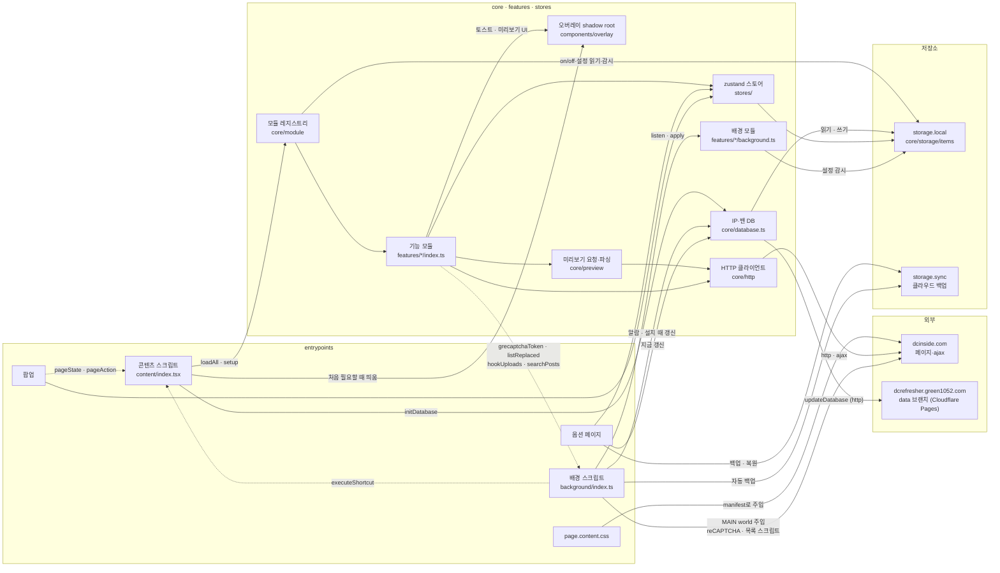
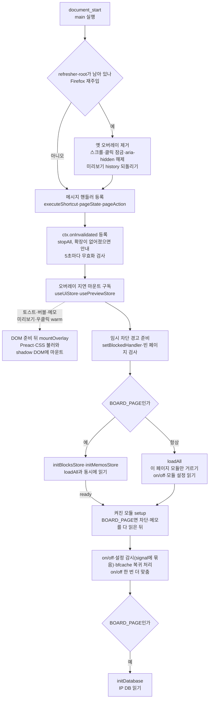

# 구조

디렉터리 구성, 콘텐츠·배경 스크립트가 도는 순서, 저장소와 HTTP 규칙입니다.

## 디렉터리

```
entrypoints/
  background/           배경 스크립트
    index.ts            리스너 등록 순서, 단축키 전달, 설치·업데이트 처리, 배경 모듈 실행
    page.ts             탭의 페이지(MAIN world)에서 대신 실행하는 것 (reCAPTCHA, 목록 스크립트, 이미지 변환)
    database.ts         IP·밴 DB 주기 갱신 알람
    backup.ts           자동 클라우드 백업 알람
  content/              콘텐츠 스크립트
    index.tsx           메시지 등록, 모듈 레지스트리 시작
    overlay.tsx         오버레이(shadow DOM)를 처음 필요할 때 띄우기
    stale.ts            파이어폭스 재주입으로 죽은 인스턴스 정리
    invalidated.ts      확장이 멈췄을 때의 안내
    blocked.ts          디시 임시 차단 안내
  page.content.css     디시 페이지에 입히는 CSS (manifest로 따로 주입)
  options/              옵션 페이지 (설정·차단·메모·단축키·데이터·정보 탭)
  popup/                팝업 (모듈 켜고 끄기, 현재 페이지 토글)
features/<id>/          기능 모듈 하나
  meta.ts               이름·아이콘·설정 스키마 (옵션·팝업이 읽는다)
  index.ts              페이지에서 하는 일 (할 일이 없는 모듈은 두지 않는다)
  background.ts         배경에서 하는 일 (선택)
  page.css             디시 페이지에 입히는 CSS (선택, 저절로 들어간다)
  overlay.css          오버레이(shadow) 안의 CSS (선택, 저절로 들어간다)
  ui/                   화면 컴포넌트 (선택)
modules/                WXT 로컬 모듈: 모듈 api·설정 타입 생성(module-types.ts), 단축키 모으기(commands.ts),
                        기능별 페이지 CSS 모으기(feature-styles.ts).
                        WXT가 바로 아래 파일을 모두 모듈로 불러오므로 같이 쓰는 도우미는 lib/에 둔다 (features/ 폴더 찾기)
core/                   모듈 시스템, 저장소 키, HTTP, 필터링, 차단 판정, 미리보기 요청·파싱, 백업, 설정 옮기기, DB
stores/                 여러 화면이 같이 쓰는 zustand 스토어 (모듈 on/off·설정, 차단, 메모, 오버레이 UI)
components/             공용 컴포넌트, 오버레이 루트(components/overlay)
components/ui/          shadcn 부품. 손으로 만들지 않고 CLI로 추가한다 (bunx shadcn add <이름>, 설정은 components.json)
utils/                  작은 도우미 (DOM, 이벤트, 정화, 다크모드, 캐시, 동시 실행 제한, 타입 붙인 Object 함수)
assets/styles/          디시 페이지 CSS(content.css), 오버레이 CSS(overlay.css), 두 문서가 같이 쓰는 유틸리티(shared.css), Tailwind·shadcn 토큰과 공용 애니메이션(tailwind.css)
scripts/                IP DB 빌드 스크립트 (GitHub Actions의 DB 워크플로가 실행)
tests/                  단위 테스트: unit/(소스 경로를 따라 둔다), setup.ts(공통 준비), helpers.ts(공통 도우미)
e2e/                    Playwright E2E: 가짜 디시 페이지, 페이지 객체(pages/), 파이어폭스 설치(firefox.ts)
```

`features/index.ts`가 `import.meta.glob("./*/index.ts")`로 모듈을, `features/meta.ts`가 `./*/meta.ts`로 모듈 메타를 모읍니다. 새 폴더를 만들면 목록에 따로 등록할 필요가 없습니다. 콘텐츠 스크립트만 `features/index.ts`를 쓰고, 옵션·팝업·`stores/modules.ts`는 `features/meta.ts`를 씁니다. setup이 쓰는 HTTP 클라이언트·캐시·DOM 코드가 옵션·팝업 번들에 딸려 가지 않게 하기 위해서입니다.

확장의 진입점, 공용 코드, 저장소, 외부 서버가 어떻게 이어지는지 한눈에 본 그림입니다. 실선은 호출·읽기·쓰기이고 점선은 `core/messaging/protocol.ts`의 메시지입니다.



## 실행 흐름

### 콘텐츠 스크립트

`entrypoints/content/index.tsx`가 디시 페이지(`core/pages.ts`의 `CONTENT_MATCHES`)에서 `document_start`에 실행됩니다.

1. Firefox가 재주입하며 남긴 옛 오버레이와 잠금을 걷어 내고(`stale.ts`), 단축키·팝업 메시지를 받을 준비를 합니다.
2. 저장소를 기다리기 전에, 확장이 업데이트되거나 꺼져 컨텍스트가 무효가 되면 모듈을 멈추는 처리를 겁니다. 확장이 정말 없어졌을 때만 새로고침 안내를 띄웁니다(`invalidated.ts`).
3. 오버레이는 바로 띄우지 않습니다(`overlay.tsx`). 토스트, 유저 버블, 미리보기처럼 화면에 그릴 것이 처음 생길 때 Preact와 오버레이 CSS를 불러와 띄웁니다. 글 제목에서 오른쪽 버튼을 누르는 순간에도 미리 띄워 첫 미리보기 창을 빨리 보이게 합니다.
4. 글 목록·본문 페이지(`BOARD_PAGE`)면 차단·메모 스토어를 읽기 시작하고, 동시에 모듈 on/off와 설정을 읽습니다(`core/module/registry.ts`의 `loadAll`). 모듈의 `setup`은 차단·메모를 다 읽은 뒤에 돕니다. 차례로 기다리면 저장소 왕복이 쌓여 모듈이 목록을 한참 읽은 뒤에야 뜹니다.
5. 글 목록·본문 페이지에서는 모듈을 다 불러온 뒤 가장 큰 IP DB를 읽습니다(`core/database.ts`의 `initDatabase`, userinfo가 켜져 있으면 그 setup이 먼저 부릅니다). 저장소는 요청 순서대로 읽히기 때문입니다. 밴 DB는 처음 조회할 때 읽습니다.

콘텐츠 스크립트가 뜰 때 도는 순서입니다. 점선은 조건이 생길 때만 도는 길이고, 글 목록·본문 페이지에서는 차단·메모 스토어와 모듈 on/off·설정을 동시에 읽은 뒤에 모듈 `setup`이 돕니다.



모듈은 이 문서를 불러온 주소(`core/http/urls.ts`의 `documentUrl`)로 판단합니다. 미리보기가 주소창을 글 주소로 바꿔도 페이지가 보여 주는 것은 그대로이기 때문입니다.

### 배경 스크립트

배경은 뜰 때마다 리스너를 동기로 겁니다. Chrome은 서비스 워커라 언제든 멈췄다 다시 뜨므로, 전역 변수에 상태를 두지 말고 저장소에 둡니다.

| 파일 | 하는 일 |
|------|---------|
| `index.ts` | 아래 파일들과 배경 모듈의 `listen()`을 부르고, 설치·업데이트를 처리합니다 |
| `page.ts` | 콘텐츠 스크립트 대신 탭의 페이지(MAIN world)에서 실행합니다. reCAPTCHA 토큰(`refresher:grecaptchaToken`), 갈아끼운 목록에 디시 스크립트 다시 걸기(`refresher:listReplaced`), 글쓰기 이미지 변환 넣기(`refresher:hookUploads`) |
| `database.ts` | IP·밴 DB를 하루마다 확인해 7일이 지났거나 저장 형식이 옛것이면 받습니다. 알람은 배포 빌드에서만 만듭니다 |
| `backup.ts` | 설정이 바뀌면 1분 뒤 자동 클라우드 백업을 돌립니다 |

- **설치·업데이트 때** (`onInstalled`): 배경 모듈을 맞추고 IP·밴 DB를 받습니다. 개발 빌드는 DB가 없을 때만 받습니다.
- **통합검색 대신 받기** (`refresher:searchPosts`): 디시 통합검색은 CORS를 열지 않아, 관리 모듈의 같은 제목 찾기는 배경이 받아 줍니다.

## 저장소

- 모든 키는 `core/storage/items.ts`에 모읍니다. `storage.defineItem`을 쓰고 직접 만든 저장소 래퍼는 두지 않습니다.
- `defineItem`은 만드는 순간 값을 한 번 읽습니다. 그래서 항목은 모듈 최상위가 아니라 처음 쓸 때 만듭니다(`items.ts`의 `lazyItem`·getter). 안 그러면 이 파일을 불러오는 모든 디시 페이지와 서비스 워커가 깰 때마다 쓰지도 않는 키를 십여 번 읽습니다.
- 읽기만 하는 곳은 항목을 만들지 않고 키로 읽고 감시합니다. 여러 키를 `storage.local.get` 한 번으로 읽고, 없는 값은 `null`이 오므로 받는 쪽이 기본값으로 맞춥니다. 항목은 쓸 때(`setValue`)와 옵션 페이지의 `useStorageItem`에서 씁니다.
  - 스토어처럼 키 여러 개를 읽고 따라가야 하면 `core/storage/sync.ts`의 `storageSync(keys, apply)`를 씁니다. 한 번에 읽고, 키마다 감시하고, bfcache에서 돌아오면 다시 읽습니다. 차단·메모·모듈 스토어가 이것을 씁니다.
  - 콘텐츠 스크립트의 감시는 `watchStorage(key, cb, signal)`로 컨텍스트의 signal에 묶습니다. 파이어폭스에서 스크립트가 다시 주입되면 이전 인스턴스가 남는데, 묶어 두면 그 인스턴스는 더 반응하지 않습니다.
  - 모듈 on/off와 설정은 `core/module/settings.ts`의 `readModuleStorage(ids)`로 읽고 `enablesOf`·`settingsOf`로 맞춥니다. 콘텐츠 레지스트리, 옵션·팝업 스토어, 배경 모듈이 같은 함수를 씁니다.
- 예외: IP·밴 DB(`DB_KEYS`)는 수백 KB라 항목을 아예 만들지 않습니다. 이 키는 쓰는 곳에서 `storage.getItem`·`storage.watch`로 다룹니다.
- 모듈 캐시(계속 불어나는 데이터)는 `moduleDataStorage(id, fallback)`로 만들되, 만드는 순간 값을 읽으므로 모듈 최상위가 아니라 `setup` 안에서 만듭니다. 이 키는 백업·내보내기와 자동 백업 대상에서 빠집니다. 개수 상한을 두세요 (글댓비 캐시는 500명).
- 백업 대상 판정은 `core/backup.ts`의 `isBackupTarget`입니다. 모듈 on/off와 설정, 차단 목록과 기본 차단 모드, 메모만 담고 나머지 키는 담지 않습니다. 새 키를 백업·내보내기·클라우드 복원에 넣으려면 여기의 `BACKUP_KEYS`에 추가합니다. 클라우드 백업은 `storage.sync`의 용량(약 100KB)을 두 칸(수동·자동)이 나눠 씁니다. 전체·항목당 한도는 숫자로 적지 않고 `storage.sync.QUOTA_BYTES`·`QUOTA_BYTES_PER_ITEM`에서 읽습니다.
- 차단 항목의 검사 방식(`mode`)이 비어 있으면 그 기기의 기본 차단 모드를 따릅니다. 그래서 차단 목록을 다른 기기로 옮기는 곳(데이터 탭 가져오기, 클라우드 합치기, 차단 탭 가져오기)은 내보낸 쪽의 기본 모드가 다르면 그 모드를 항목에 적어 둡니다. 새로 옮기는 경로를 만들 때도 같은 규칙을 따릅니다.
- 설정을 없애거나 이름을 바꿀 때 옛 값을 옮기는 코드는 두지 않습니다. 옵션·팝업을 열면 `stores/modules.ts`의 `pruneStaleSettings`가 스키마에 없는 설정을 지우므로, 이름을 바꾼 설정은 기본값으로 돌아갑니다.
- 차단 항목과 메모가 이 기기에서 마지막으로 쓰인 시각은 `core/usage.ts`가 `refresher:usage`에 모아 적습니다(차단은 `core/block.ts`의 검사, 메모는 `stores/memos.ts`의 찾기). 여러 탭과 옵션 페이지가 함께 고치는 값이라 쓰기는 배경이 메시지(`refresher:markUsed`, `refresher:syncUsage`)를 받아 차례로 합니다. 옵션의 차단·메모 탭이 오래 안 쓰인 항목을 거를 때 쓰고, 기록이 없는 항목은 옵션을 연 때를 기준으로 둡니다. 기기마다 다른 값이라 백업하지 않습니다.
- 클라우드 복원·합치기, JSON 가져오기, 초기화가 저장소에 쓰는 규칙(지울 키, 합치는 방법, 기본 차단 모드 고정)은 `core/settings-transfer.ts`에 모여 있고 단위 테스트가 있습니다. `storage.local`을 직접 다루는 곳은 키 이름을 문자열로 적지 말고 `rawKey(MODULES_KEY)`처럼 `items.ts`의 키에서 만듭니다.

## HTTP

`core/http/client.ts`의 `http`(일반 요청)와 `ajax`(`X-Requested-With` 헤더를 붙인 디시 ajax 요청)를 씁니다.

- 두 클라이언트가 `utils/limit.ts`의 제한기 하나를 같이 써서 합친 동시 요청 수를 제한합니다(ky 재시도 요청도 포함). 제한 값은 "요청 제한" 모듈 설정이고, 모듈이 꺼져 있거나 옵션·배경 페이지면 제한하지 않습니다. 탭마다 따로 셉니다.
- Firefox 콘텐츠 스크립트에서는 두 클라이언트 모두 `content.fetch`로 보냅니다. 페이지가 보낸 요청처럼 나가야 디시 ajax가 받아 줍니다.
- 시간 제한(15초)은 동시 요청 수 제한의 차례를 받은 뒤부터 응답 머리를 받을 때까지만 잽니다. 본문을 받는 동안은 재지 않습니다(느린 회선에서 IP DB 같은 큰 본문을 끊지 않게). 그런데 dcinside.com GET은 임시 차단 검사(ky `afterResponse` 훅 `detectBlocked`)가 `http.get` 안에서 본문을 다 읽으므로, 본문이 멈추면 `http.get` 자체가 끝나지 않습니다. 멈추면 안 되는 요청은 호출하는 쪽이 요청 전체에 `signal`로 제한을 겁니다(글 목록 새로고침의 `LIST_TIMEOUT`). ky의 `timeout`은 `fetch`를 부르는 순간부터 재서 차례를 기다리는 시간까지 들어가므로 쓰지 않습니다(호출할 때도 주지 마세요). 시간 제한은 `AbortController`와 `setTimeout`으로 겁니다. `AbortSignal.timeout`은 Firefox 콘텐츠 스크립트에서 던집니다.
- 재시도는 ky 기본값(GET 같은 멱등 메서드만 최대 2번, 408·413·429·5xx 응답과 네트워크 오류)에 지터를 더하고, `Retry-After`는 최대 10초까지만 기다립니다. 15초 시간 초과와 `BlockedError`는 재시도하지 않고, 댓글 목록·쓰기 같은 POST도 재시도하지 않습니다. 자동 새로고침은 `retry: 0`으로 보내고, 실패하면 주기를 늘립니다.
- 요청이 너무 많으면 디시는 상태 코드 없이(200) 빈 페이지를 줍니다. 클라이언트는 dcinside.com의 GET 응답과 `/board/comment/` 아래 요청(댓글 목록·삭제)이 비어 있을 때만 `BlockedError`를 던집니다. 다른 ajax POST는 성공 응답도 비어 있을 수 있어 검사하지 않습니다. 콘텐츠 스크립트가 1분에 한 번 안내를 띄우므로, 기능 쪽에서는 `e instanceof BlockedError`일 때 자기 오류 토스트를 건너뜁니다(`stores/notify.ts` 참고).
- 갤러리 종류는 `core/http/urls.ts`의 `galleryKind(url)`(`"normal" | "minor" | "mini" | "person"`)로 다룹니다. 주소 경로(`mgallery/` 등)와 요청의 `_GALLTYPE_` 값(`G`·`M`·`MI`·`PR`)은 같은 파일의 표에만 두고, 주소·요청을 만들 때 `galleryPath`·`galltypeOf`로 꺼냅니다.
- 폼 본문은 `formBody({...})`로 만듭니다. 값이 `null`·`undefined`·`false`인 필드는 빠지고, 빈 문자열은 들어갑니다. CSRF 토큰(`ci_t`)이 붙는 디시 요청은 `csrfBody({...})`(`core/http/cookie.ts`)를 씁니다. 끊은 요청인지는 `isAbortError(e)`로 봅니다.
