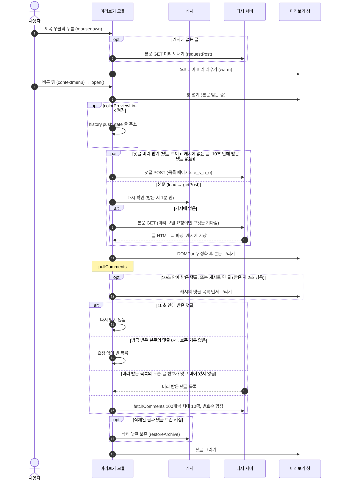
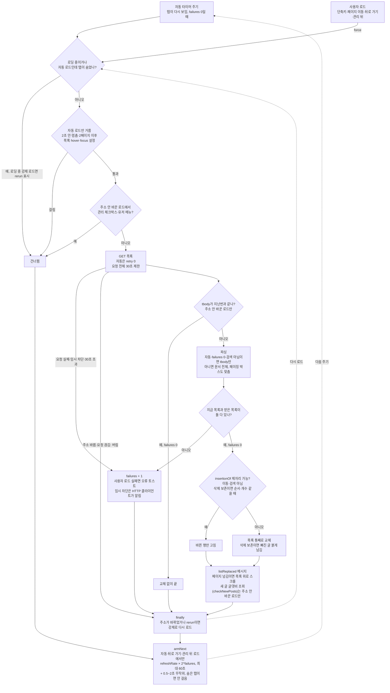

# 기능별 구조

미리보기와 글 목록 새로고침처럼 큰 기능의 내부 구조입니다.

## 미리보기

`features/preview`가 가장 큰 모듈입니다.

| 파일 | 역할 |
|------|------|
| `index.ts` | 모듈 정의, 글·댓글 요청 흐름, 관리·차단 키, 주소창 기록 |
| `rows-input.ts` | 목록 행·제목 칸의 마우스 입력 (우클릭·길게 누르기·키 반전 좌클릭) |
| `mini.ts` | 미니 미리보기(제목 호버 카드)의 타이머·대상. 지연 시간(최소 200ms) 동안 머문 제목만 글을 받아, 목록을 훑을 때 지나는 행마다 요청이 나가지 않는다 |
| `keyboard.ts` | 목록 키보드 이동 (J/K로 고르기, Enter 미리보기, O 글 열기) |
| `read.ts` | 미리보기로 읽은 글 표시. 모듈 캐시 키(`refresher:module:preview:data`)에 최근 3000개를 둔다 |
| `comment-submit.ts` | 댓글·디시콘·글자콘 보내기 (reCAPTCHA v3 재전송, 성공·실패 판정). 폼은 `ui/WriteComment.tsx` |
| `rows.ts` | 목록 행 → 미리보기 대상(`GalleryPreData`), 보이는 행 목록, 앞·뒤 글 찾기 |
| `ui/previewStore.ts` | 미리보기 창 상태 (zustand) |
| `meta.ts` | 모듈 메타(이름·아이콘)와 설정 스키마 |
| `ui/Frame.tsx` | 창 (머리, 본문, 댓글 칸, 휠로 넘기기) |
| `ui/Votes.tsx`, `ErrorBlock.tsx`, `CountDown.tsx`, `fitMovies.ts`, `gifVideos.ts` | 추천 버튼, 오류 안내, 자동 삭제 카운트다운, 디시 동영상 iframe 크기 맞추기, 깨진 디시콘·움짤 mp4를 gif로 바꾸기 |
| `ui/CommentList.tsx`, `Comment.tsx`, `WriteComment.tsx` | 댓글 목록(답글 접기), 댓글 하나(새 댓글 강조), 댓글 쓰기 |
| `ui/ImageViewer.tsx` | 본문 이미지 크게 보기 |
| `ui/UserCard.tsx`, `TimeStamp.tsx` | 작성자 표시(배지·유저 버블), 상대 시각(공용 시계)과 `useTick`. 글 머리와 댓글이 같이 쓴다 |
| `ui/PreviewHost.tsx` | 미리보기 UI 최상위 (Frame·Popups·Mini) |
| `ui/Popups.tsx`, `Mini.tsx`, `DcconPopup.tsx` | 관리 패널·차단 팝업, 미니 미리보기, 디시콘 고르기 |
| `ui/DcconInfoPopup.tsx` | 본문·댓글 디시콘을 눌렀을 때 뜨는 디시콘 정보 창(패키지 보기, 패키지 추가, 우클릭 차단) |
| `nonmember.ts` | 비회원 닉네임·비밀번호 (디시 localStorage를 같이 씀) |
| `core/preview/request.ts` | 글·댓글 받기와 추천. 나머지 디시 요청은 각 파일로 나뉘고 여기서 다시 내보낸다 |
| `core/preview/manage.ts` | 관리 요청(끌올·삭제·차단·공지·개념글·댓글 삭제)과 캡챠 |
| `core/preview/submit.ts`, `txtcon.ts`, `dccon.ts` | 댓글·디시콘 작성, 글자콘 입력 규칙과 작성, 디시콘 패키지 정보·추가 |
| `core/preview/response.ts` | 요청 본문(dcBody)과 `result||message||detail` 응답 공통 도구 |
| `core/preview/parser.ts` | 글 HTML 파싱 (DOMParser) |
| `core/preview/comments.ts` | 댓글 정리, 차단·같은 댓글 접기, 삭제된 댓글 보존 |
| `core/preview/cache.ts` | 글·댓글 캐시 (1분, 50개). 댓글은 받은 시각도 둔다 |
| `core/preview/types.ts` | `GalleryPreData`·`PostInfo`·댓글 타입 |

글을 여는 흐름은 이렇습니다.

1. 캐시에 없는 글이고 목록 행에 댓글 수가 보이면(10초 안에 받은 댓글이 없을 때), 본문 요청과 함께 댓글 목록도 요청합니다. 댓글 토큰(`e_s_n_o`)은 갤러리마다 같아서 목록 페이지의 값을 쓰고, 본문을 읽은 뒤 그 글의 토큰·댓글 번호와 맞을 때만 결과를 씁니다. PageUp/PageDown이나 스크롤 끝 휠로 앞뒤 글로 넘길 때는 미리 요청하지 않습니다.
2. 10초 안에 받은 댓글 목록이 캐시에 있으면 그것을 그리고 다시 받지 않습니다(`COMMENTS_REUSE`). 댓글은 쪽마다 요청이라, 같은 글을 열고 닫거나 앞뒤 글을 오갈 때마다 받으면 몇 초 만에 요청이 몰려 임시 차단됩니다(#273). 새로고침 버튼·자동 새로고침은 늘 받고, 캐시 비활성화를 켜면 늘 받습니다. 그보다 오래된 캐시로 다시 연 글은 지난번 댓글 목록을 먼저 그리고, 새로 받은 목록이 같으면 다시 그리지 않습니다.
3. 댓글은 한 쪽에 100개씩 최대 10쪽을 받아 번호(등록)순으로 합칩니다. 디시 API는 1쪽에 가장 최근 댓글을 줍니다. 부모를 받지 못한 답글은 쓰레드 첫 댓글처럼 그립니다. 목록의 댓글 수로 쪽 수를 어림해 1쪽과 함께 요청하고, 1쪽의 쪽 나눔을 보고 모자란 쪽을 마저 받습니다.
4. 댓글을 그리는 곳(`pullComments`)은 순번으로 늦게 온 옛 목록이 새 목록을 덮지 않게 합니다. 댓글을 받는 새 경로를 만들 때는 이 함수 안에서 기다리게 합니다.

목록에서 글을 우클릭해 미리보기를 여는 순서입니다. 버튼을 누르는 동안 본문을 미리 받고, 연 뒤에는 댓글 요청을 본문 요청과 함께 보냅니다.

'주소창에 게시글 주소 표시'(`colorPreviewLink`, 기본 켜짐)가 켜져 있으면 미리보기가 글 주소를 기록에 쌓고, 닫을 때 쌓은 만큼 뒤로 갑니다. 브라우저 기록이 50개까지라 40칸이 넘으면 새로 쌓지 않고 바꿉니다. 뒤로·앞으로 가기로 미리보기 항목에 돌아왔는데 목록 문서가 bfcache에 없어 글 주소로 새로 불러오면(Firefox에서 잦음), 목록 주소로 바꿔 다시 불러온 뒤 그 글 미리보기를 엽니다. 새로고침(F5)은 글 페이지 그대로 둡니다.

본문 HTML은 `utils/sanitize.ts`에서 DOMPurify로 정화합니다. 재사용하는 `<template>`에서 `IN_PLACE`로 정화하는데, `<video>`가 든 DOMParser 문서는 Chrome에서 해제되지 않기 때문입니다. 파서도 같은 이유로 문서의 video·audio를 지우고 문서를 들고 있지 않습니다. 창을 닫거나 다음 글로 넘어가 문서에서 빠진 영상은 받기를 끊습니다(`gifVideos.ts`).

## 글 목록 새로고침

`features/refresh`는 목록을 받아 지금 목록 자리에 넣습니다.

- **자동 새로고침**은 목록 표만 파싱합니다. 받은 tbody가 지난번과 같으면 파싱도 하지 않습니다.
- 주소를 바꾸지 않은 로드(자동·단축키·관리 뒤 새로고침)는 검색 결과가 아니고 행 순서가 같거나 새 글이 한 자리(공지 아래)에 끼어든 것뿐이면 바뀐 행만 고칩니다(`list.ts`의 `insertionOf`). 조회·추천·댓글 수만 바뀐 행은 갈아끼우지 않고 숫자만 고칩니다. 그대로인 행은 hover·리스너가 남고 필터와 스타일 계산을 다시 하지 않습니다. '삭제된 글과 댓글 보존'이 켜져 있고 거르지 않은 1페이지(개념글·공지·말머리 목록이 아님)면 행 순서와 개수가 그대로일 때만 제자리에서 고칩니다. 그 밖에는 목록을 통째로 바꿉니다.
- **사용자가 한 로드**(단축키, 미리보기 관리·차단 뒤 새로고침, 페이지 번호 이동, 뒤로·앞으로 가기)와 검색 결과, 직전 요청이 실패한 다음 새로고침은 문서 전체를 파싱해 페이징 박스도 맞춥니다.
- 자동 새로고침을 건너뛰는 경우: 탭이 보이지 않을 때(숨은 탭 새로고침 설정을 켜면 그 주기로 받는다), 직전 새로고침 후 2초 안, 이전 요청을 받는 중일 때, 2페이지 이후, 목록 위에 마우스·포커스가 있을 때(설정), 사용자가 멈췄을 때(검색 결과는 설정에 따라 멈춘 채 시작). 관리 체크박스를 체크했거나 목록 행의 디시 유저 메뉴가 열려 있으면, 주소를 바꾸지 않는 로드는 단축키·관리 뒤 새로고침까지 건너뜁니다.
- 미리보기가 열려 있어도 자동 새로고침은 쉬지 않습니다.
- 목록 요청 하나에는 차례 기다리기·응답 머리·본문을 합쳐 30초 제한(`LIST_TIMEOUT`)을 겁니다. HTTP 클라이언트의 15초는 응답 머리까지만 재고 임시 차단 검사가 `http.get` 안에서 본문을 읽으므로, 본문이 멈추면 `loading`이 풀리지 않아 자동 새로고침이 끝내 멈추기 때문입니다([HTTP](architecture.md#http)). 이 제한으로 끊긴 요청은 실패로 셉니다.
- 목록 요청이 실패하면(임시 차단과 목록 없는 응답 포함) 주기를 두 배씩 늘리고(최대 60초), 한 번 성공하면 원래 주기로 돌아갑니다. 실제 간격에는 0.5~2초가 무작위로 더해집니다.
- 미리보기가 쌓은 기록 사이를 뒤로·앞으로 가는 것은 같은 목록이라 다시 받지 않습니다.

목록을 한 번 받을 때의 흐름입니다. 자동 타이머와 사용자가 한 로드(force)는 거르는 조건이 다르고, 실패하면 다음 주기가 두 배씩 늘어납니다.

