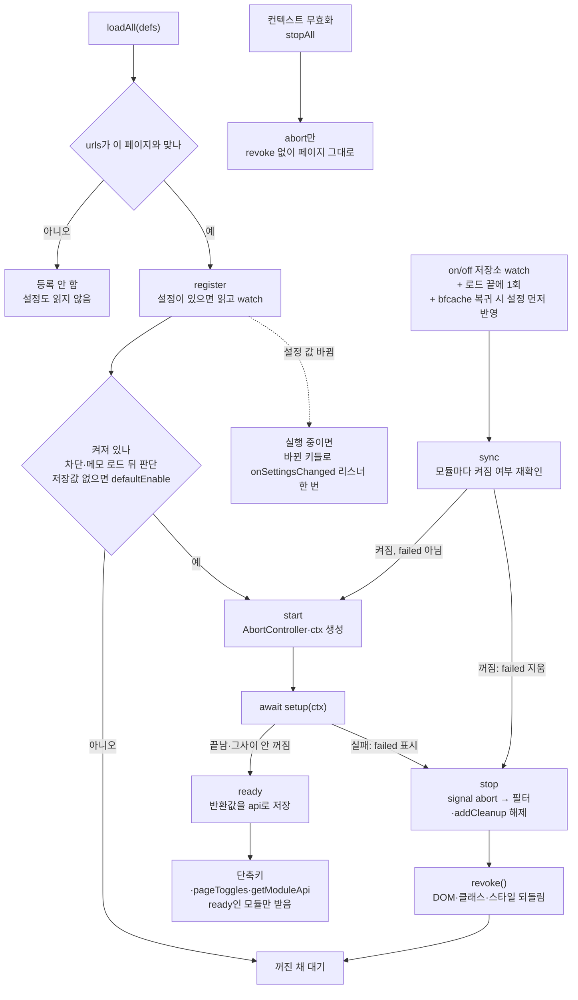

# 모듈

기능 모듈을 만들고 설정·단축키·팝업 토글을 붙이는 방법입니다.

## 새 기능 추가하기

기능은 모듈 폴더 하나에 모읍니다. 다른 곳의 목록에 등록하지 않습니다.

| 하려는 것 | 고치는 곳 |
|---|---|
| 새 모듈 | `features/<id>/meta.ts`, `index.ts` (런타임은 `features/index.ts`의 glob, 타입은 `modules/module-types.ts`가 모은다) |
| 설정 | `meta.ts`의 `settings`. 페이지 코드는 `ctx.settings`, React는 `useModuleSettings(id)`로 읽는다. 바뀔 때 할 일은 setup의 `ctx.onSettingsChanged` |
| 단축키 | `meta.ts`의 `commands`와 `index.ts`의 `shortcuts` (manifest는 `modules/commands.ts`가 만든다) |
| 팝업 '현재 페이지' 토글 | `meta.ts`의 `toggles`와 `index.ts`의 `pageToggles` |
| 디시 페이지 CSS | `features/<id>/page.css` |
| 오버레이 UI | 컴포넌트와 그 스토어. 스토어에 `needOverlayWhen(store, (state) => …)`로 띄울 조건을 등록한다. CSS는 `features/<id>/overlay.css` |
| 배경에서 할 일 | `features/<id>/background.ts` (`defineBackgroundModule`, 배경이 glob으로 모은다) |
| 다른 모듈에 줄 api | setup의 반환값. 받는 쪽은 `getModuleApi(id)` |

## 모듈 정의

모듈은 두 파일로 나뉩니다. 옵션·팝업이 그리는 데 필요한 정보는 `features/<id>/meta.ts`에서 `defineModuleMeta`로, 페이지에서 하는 일은 `features/<id>/index.ts`에서 메타를 펼쳐 `defineModule`로 정의해 각각 default로 내보냅니다. 가장 작은 예는 `features/requests`입니다.

```ts
// meta.ts — 옵션·팝업·콘텐츠가 모두 불러오므로 React 컴포넌트(lucide 아이콘) 말고는 가벼운 것만 둔다
export default defineModuleMeta({
    id: "requests",            // 저장소 키에 쓰인다. 바꾸면 사용자 설정이 끊긴다
    name: "요청 제한",          // 옵션·팝업에 보이는 이름
    description: "…",
    icon: Gauge,               // lucide 아이콘
    // urls: [BOARD_PAGE],     // 이 주소에서만 실행 (core/pages.ts). 없으면 모든 디시 페이지, []면 어디서도 실행하지 않음
    // defaultEnable: false,   // 저장된 on/off가 없을 때(새로 설치했거나 업데이트로 새로 생긴 모듈) 꺼 둘 모듈

    settings: {
        concurrency: {type: "range", name: "동시 요청 수", desc: "…", default: 4, min: 1, max: 10, step: 1, unit: "개"}
    }
});

// index.ts — 콘텐츠 스크립트만 불러온다
export default defineModule({
    ...meta,

    setup(ctx) {
        setRequestConcurrency(ctx.settings.concurrency);
        ctx.onSettingsChanged(() => setRequestConcurrency(ctx.settings.concurrency));
    },
    revoke() { setRequestConcurrency(Number.POSITIVE_INFINITY); }
});
```

`meta.ts`에서 `settings`를 `satisfies SettingsSchema`로 따로 내보내면 `index.ts`의 도우미 함수가 `ModuleContext<typeof settings>`로 설정 타입을 이어 받습니다(아래 [컨텍스트](#컨텍스트-ctx)). 설정 스키마가 쓰는 상수(폰트 이름 만들기, 숨김 선택자 등)도 `meta.ts`에 두고 `index.ts`가 가져다 씁니다.

- **setup(ctx)**: 모듈이 켜진 페이지에서 실행됩니다. 돌려준 값은 그 모듈의 api가 되어 단축키·팝업 토글·다른 모듈이 받습니다. setup이 던지면 레지스트리가 그 실행을 멈추고(revoke 포함) 실패로 표시해, 그 페이지에서는 모듈을 껐다 켤 때까지 다시 시작하지 않습니다. 다른 모듈을 켜고 끌 때마다 실패를 되풀이하지 않게 하기 위해서입니다(`core/module/registry.ts`의 `failed`).
- **revoke()**: 모듈을 끄면 실행됩니다. 페이지에 넣은 DOM·클래스·스타일을 되돌립니다.
- **ctx.onSettingsChanged(listener)**: 켜져 있는 동안 설정이 바뀌면 바뀐 키들(Set)로 한 번 부릅니다. 가져오기처럼 여러 키가 한꺼번에 바뀌어도 한 번입니다. setup 안에서 등록하므로 setup이 만든 상태(타이머, 다시 판정하는 함수 등)를 그대로 씁니다. 모듈 전역 변수로 setup과 이을 필요가 없습니다. `ctx.settings`는 늘 최신 값이므로, 설정을 쓸 때마다 읽는 모듈은 등록하지 않아도 됩니다.
- 객체를 쓸 때 `setup`을 `shortcuts`, `pageToggles`보다 앞에 둡니다. TypeScript가 api 타입을 `setup`의 반환값에서 추론하기 때문입니다.

모듈 하나가 등록되고 켜지고 꺼지기까지의 흐름입니다. 단축키와 팝업 토글은 setup이 끝나 api가 준비된 모듈에만 전달되고, 끄면 signal을 먼저 abort한 뒤 revoke를 부릅니다. setup이 실패한 모듈은 꺼질 때까지 sync가 다시 시작하지 않습니다.



## 컨텍스트 (ctx)

| 멤버 | 용도 |
|------|------|
| `settings` | 현재 설정값. 스키마에서 타입이 나온다 (check → boolean, range → number, option → 항목 키, order → 항목 키 배열) |
| `signal` | 이 실행의 AbortSignal. 모듈이 꺼지면 abort된다. `addEventListener`에 `{signal}`로 넘긴다 |
| `addFilter(selector, fn)` | 지금 있는 요소와 이후 추가되는 요소마다 `fn`을 실행한다 (core/filtering.ts의 MutationObserver 하나를 같이 쓴다) |
| `addCleanup(fn)` | signal을 받지 못하는 것(storage watch, zustand subscribe, 타이머)의 해제 함수를 등록한다 |
| `onSettingsChanged(fn)` | 켜져 있는 동안 설정이 바뀌면 바뀐 키들(Set)로 `fn`을 한 번 부른다. setup 안에서 등록한다 |

React UI는 설정을 `useModuleSettings("모듈 id")`(`core/module/useModuleSettings.ts`)로 직접 읽습니다. 옵션에서 바꾸면 바로 다시 그려지고, 타입은 모듈 메타의 스키마에서 나옵니다(`modules/module-types.ts`가 `ModuleSettings`를 채웁니다). 설정을 UI 스토어로 옮겨 적지 마세요.

`addFilter`의 `fn`은 같은 요소에 여러 번 불릴 수 있습니다. 페이지를 읽는 동안 자식이 붙을 때마다 조상 필터가 다시 불리기 때문입니다. 넣은 요소가 이미 있는지 보고 건너뛰게 만드세요(글 목록 새로고침의 버튼이 예입니다).

모듈 안의 도우미 함수가 ctx를 받을 때는 설정 스키마를 상수로 빼서 타입을 이어 줍니다.

```ts
const settings = { … } satisfies SettingsSchema;
type Ctx = ModuleContext<typeof settings>;

const apply = (ctx: Ctx): void => { … ctx.settings.bodyFontSize … }; // number

export default defineModule({ …, settings, setup: apply });
```

## 설정 스키마

`core/module/types.ts`의 `SettingSchema`입니다. 옵션 페이지가 스키마만 보고 화면을 그립니다.

| type | 값 | 추가 필드 |
|------|----|-----------|
| `check` | boolean | |
| `text` | string | `placeholder` |
| `range` | number | `min`, `max`, `step`, `unit` |
| `option` | 항목 키 | `items: {키: 이름}` |
| `order` | 항목 키 배열 | `items`. 순서를 끌어서 바꾼다 |
| `color` | `#rrggbb` | |
| `key` | 키 하나 | 소문자 영문·숫자 |

같은 `group` 객체를 가진 설정은 옵션 화면에서 한 칸에 묶여 보입니다.

저장된 값은 읽을 때 스키마에 맞게 정리됩니다(`core/module/settings.ts`의 `normalizeSettings`). 타입이 틀리면 기본값을 쓰고, `range`는 `step` 단위로 맞춰 `min`~`max`로 자릅니다. 그래서 `range`의 기본값과 `max`는 `min`에서 `step`의 배수만큼 떨어진 값이어야 합니다. 스키마에서 사라진 설정과 없어진 모듈의 설정은 확장 페이지가 열릴 때 지워집니다(`stores/modules.ts`의 `pruneStaleSettings`). 설정 키 이름을 바꾸면 옛 값이 지워지므로 이전 코드를 같이 넣습니다([저장소](architecture.md#저장소) 참고).

## 단축키와 팝업 토글

- **commands** (meta.ts): `{명령 이름: {description, key?}}`. 빌드할 때 `modules/commands.ts`가 모든 모듈의 것을 모아 manifest `commands`로 넣습니다. 브라우저 단축키 설정에는 "모듈 이름: description"으로 보이고, `key`는 처음 설치할 때의 기본 키입니다.
- **shortcuts** (index.ts): `{명령 이름: (ctx, api) => …}`. 메타의 `commands`와 이름이 같아야 합니다(`tests/unit/features/meta.test.ts`가 확인합니다). 배경 스크립트가 명령을 받아 탭으로 보내고, 레지스트리가 setup이 끝난 모듈에만 전달합니다.
- **pageToggles**: 팝업의 "현재 페이지"에 나오는 이 페이지 한정 토글입니다. 표시 정보(`id`, `label`, `icon`)는 `meta.ts`의 `toggles`에 두고(팝업이 아이콘을 여기서 찾습니다), `index.ts`의 `pageToggles`가 같은 객체를 펼쳐 `desc`(문자열 또는 `(api) => string`), `isOn(api)`, `toggle(api)`를 붙입니다. setup이 끝난 모듈의 토글만 보입니다.
  - 팝업은 처음 열 때와, 모듈 on/off 저장이 끝난 뒤에 탭에 상태를 묻습니다(`refresher:pageState`). 탭은 감시 알림을 기다리지 않고 저장소의 on/off를 직접 다시 읽어 맞춘 뒤, 시작하는 모듈의 setup이 끝나면 답합니다(`settledPageToggleStates`). 그래서 끈 모듈의 토글이 잠깐 남아 보이지 않습니다.

## 모듈 간 api

다른 모듈의 api는 `core/module/registry.ts`의 `getModuleApi(id)`로 받습니다. 그 모듈이 이 페이지에서 켜져 있고 setup이 끝났을 때만 값이 있습니다.

id와 api 타입은 따로 등록하지 않습니다. `defineModule`이 id 문자열과 `setup`의 리턴 타입을 타입에 남기고, WXT 로컬 모듈 `modules/module-types.ts`가 `features/*/index.ts`를 모아 `.wxt/types/modules.d.ts`에서 `ModuleApis`를 채웁니다(`bun install`·`dev`·`build`가 `wxt prepare`로 만듭니다). 그래서 `getModuleApi("`까지 치면 api를 내주는 모듈 id가 자동완성되고, 없는 id나 api가 없는 모듈을 넣으면 타입 오류가 납니다. 새 모듈을 만든 직후 자동완성에 안 나오면 `bunx wxt prepare`를 한 번 돌립니다.

```ts
// features/preview/index.ts — setup이 돌려주는 객체가 곧 api 타입이다
setup: (ctx): PreviewApi => { …; return {archiveArticle: () => ctx.settings.archiveArticle}; }

// features/refresh/index.ts
getModuleApi("preview")?.archiveArticle() === true
```

알림처럼 받는 쪽이 없어도 되는 신호도 이렇게 부릅니다. 받는 모듈이 꺼져 있으면 `?.`에서 끝납니다 (새로고침 → `getModuleApi("userinfo")?.checkNewPosts(rows)`, 미리보기 → `getModuleApi("refresh")?.reload()`).

## 확장 페이지 CSS 변수

모듈 설정이 옵션·팝업 화면에도 영향을 줘야 하면 `extensionPageVars(settings)`로 CSS 변수를 돌려줍니다. 모듈이 켜져 있을 때 옵션·팝업의 `<html>`에 들어갑니다. 폰트 교체 모듈이 `--refresher-font`를 이렇게 넘깁니다. 옵션·팝업 코드에 특정 모듈 이름을 적지 않기 위한 장치입니다.

## 배경 모듈

배경 스크립트에서 할 일(컨텍스트 메뉴 등)이 있으면 `features/<id>/background.ts`에서 `defineBackgroundModule`로 default 내보냅니다. `entrypoints/background/index.ts`가 glob으로 모아 실행합니다. `id`, `settings`, `defaultEnable`은 `meta.ts`와 같아야 하므로 React 없는 파일(예: `features/imagesearch/engines.ts`)에 두고 양쪽에서 가져다 씁니다. `defaultEnable`이 다르면 옵션에서는 꺼져 있는데 배경은 켜진 것으로 봅니다.

- `listen()`: 배경이 뜰 때마다 동기로 실행됩니다. 서비스 워커를 깨울 이벤트 리스너는 여기서 겁니다.
- `apply({enabled, settings})`: 모듈을 켜고 끄거나 설정이 바뀔 때, 설치·브라우저 시작 때(Firefox는 배경이 뜰 때마다) 실행됩니다. 호출은 모듈마다 순서대로 한 번에 하나씩입니다.

배경 번들에는 React가 들어가면 안 됩니다. `background.ts`는 `index.ts`(아이콘·React import)를 불러오지 않고, 같이 쓰는 값은 React 없는 파일로 뺍니다. `features/imagesearch`가 예입니다. 페이지에서 할 일이 없는 모듈은 `index.ts`를 두지 않습니다(`meta.ts`와 `background.ts`만). 콘텐츠 스크립트는 `index.ts`가 있는 모듈만 등록하므로 디시 페이지에서 설정을 읽거나 감시하지 않습니다.

배경·옵션·팝업과 콘텐츠 스크립트가 같이 불러오는 파일(`core/`, `stores/` 등)은 모듈 최상위에서 페이지 전용 값을 계산하다 던지면 안 됩니다. 한 곳에서 던지면 그 번들 전체가 멈춥니다([Firefox](firefox.md) 참고).
