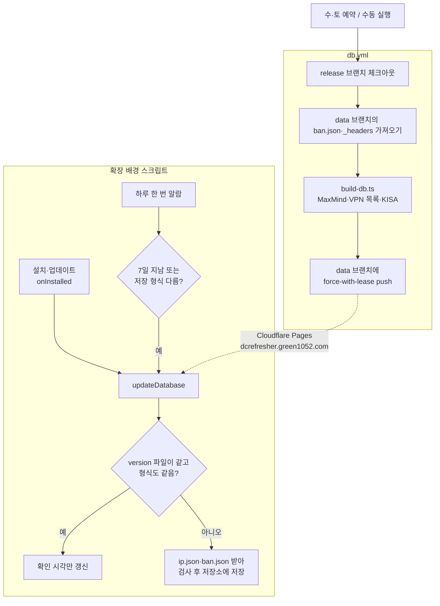

# 릴리즈

릴리즈 절차와 IP·밴 DB를 만드는 방법입니다.

## 절차

1. develop에서 `package.json`의 `version`을 올리고 `chore(release): X.Y.Z`로 커밋합니다.
2. release 브랜치에 develop을 머지 커밋(`Merge X.Y.Z into release`)으로 합치고 push합니다.
3. 버전 커밋에 `X.Y.Z` 태그를 만들어 push합니다.

태그를 push하면 `.github/workflows/release.yml`이 돕니다.

1. 태그와 `package.json` 버전이 같은지 확인합니다. 다르면 바로 멈춥니다.
2. CI 워크플로(`ci.yml`)로 타입 검사·단위 테스트와 크로미엄·파이어폭스 E2E를 돌립니다. 하나라도 실패하면 릴리즈하지 않습니다.
3. zip을 만들어 GitHub 릴리즈에 올리고 Chrome 웹 스토어와 Firefox Add-ons에 제출합니다. 제출 단계는 실패해도 넘어가므로(`continue-on-error`) 결과는 그 단계의 로그에서 확인합니다.

릴리즈는 IP·밴 DB를 만들지 않습니다([IP·밴 DB](#ip밴-db)).

## IP·밴 DB

`.github/workflows/db.yml`이 수·토요일 예약과 수동 실행(Actions → DB → Run workflow)으로 `scripts/build-db.ts`를 돌려 `data` 브랜치에 올립니다. Cloudflare Pages가 `data` 브랜치를 `dcrefresher.green1052.com`으로 배포하고, 확장은 거기서 받습니다.

- 늘 release 브랜치(배포된 코드)로 만듭니다. 형식을 바꾼 코드가 릴리즈 전에 올라가지 않게 하려는 것입니다.
- `ip.json`은 확장이 저장하는 형식(`core/ipdb.ts`의 `CompactIpData`) 그대로이고 버전(UTC, 분까지)을 담습니다. `ban.json`과 `_headers`는 `data` 브랜치에서 손으로 관리하며, 워크플로가 가져와 다시 올립니다.
- `_headers`는 CORS를 열고(확장은 호스트 권한 없이 받는다), `version`은 5분, `ip.json`·`ban.json`은 1시간 캐시합니다.
- `data` 브랜치는 커밋 하나로 유지합니다. 빌드 사이 `data`가 바뀌었으면(ban.json 수정 등) 덮어쓰지 않고 실패합니다.
- 6.0.3 이하는 `raw.githubusercontent.com`에서 받으므로 GitHub `data` 브랜치 게시는 유지합니다.
- 확장은 `version` 파일을 먼저 받아 저장된 버전과 다를 때만 `ip.json`·`ban.json`을 받습니다(`core/database.ts`의 `updateDatabase`). 세 파일 모두 브라우저 캐시를 서버에 다시 확인하고 받습니다(`cache: "no-cache"`). 옵션의 '지금 갱신'은 같은 버전이어도 다시 받습니다. 받은 파일이 깨졌으면 저장하지 않고 갖고 있던 DB를 씁니다.

**IP DB 형식(`IP_FORMAT`)을 바꾸면** 옛 확장은 새 `ip.json`을, 새 확장은 옛 `ip.json`을 읽지 못합니다. 형식을 바꾼 버전을 릴리즈했으면 DB 워크플로를 바로 수동으로 돌립니다. 돌리지 않으면 다음 예약 실행까지 새 버전 사용자가 IP 정보를 받지 못합니다(6.0.2). 두 스토어의 심사 시점이 달라 한동안 옛 버전과 새 버전이 섞이므로 형식은 꼭 필요할 때만 바꿉니다.
